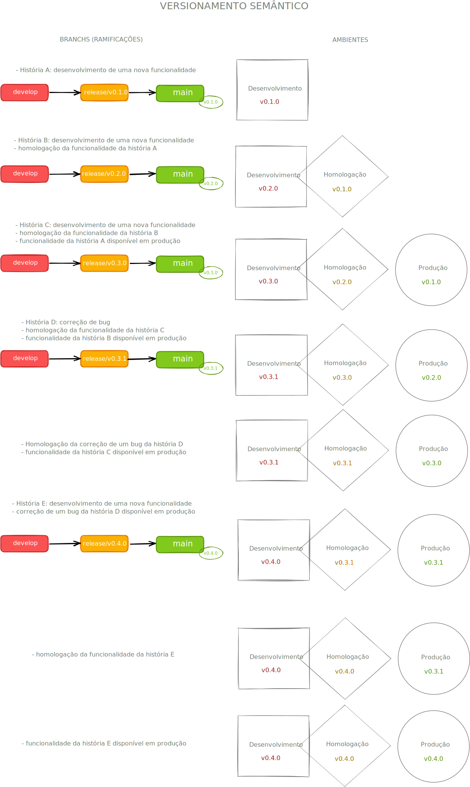
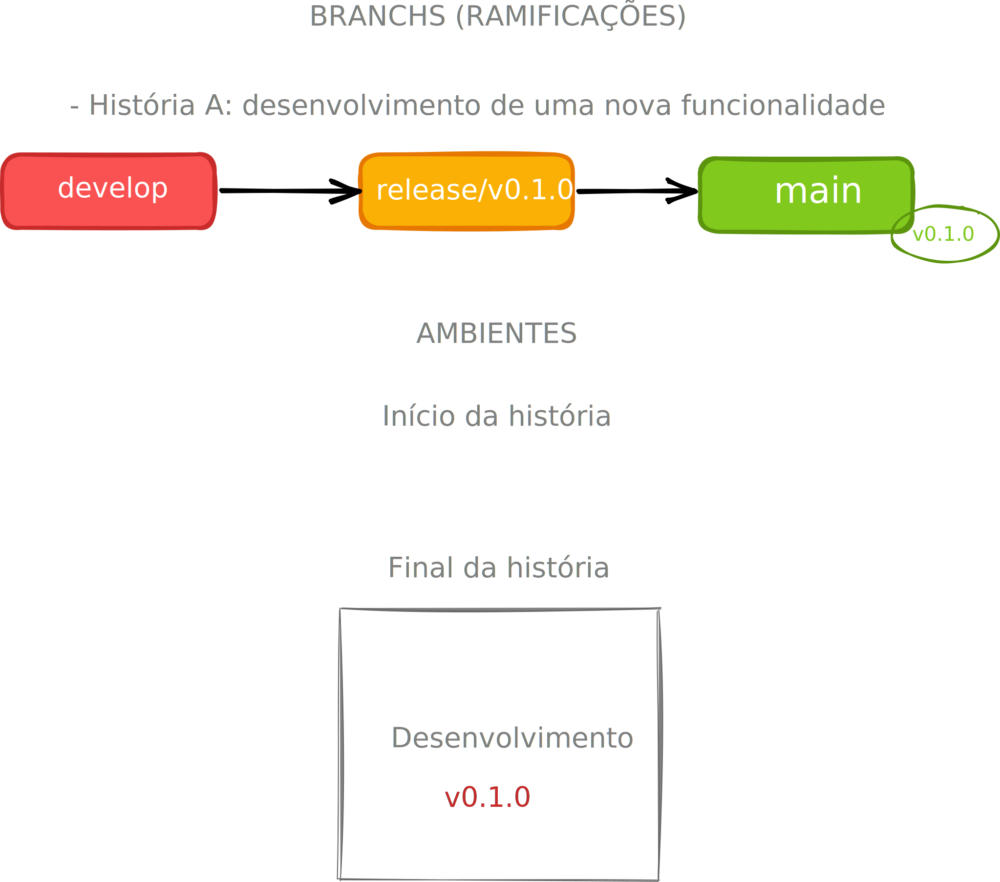
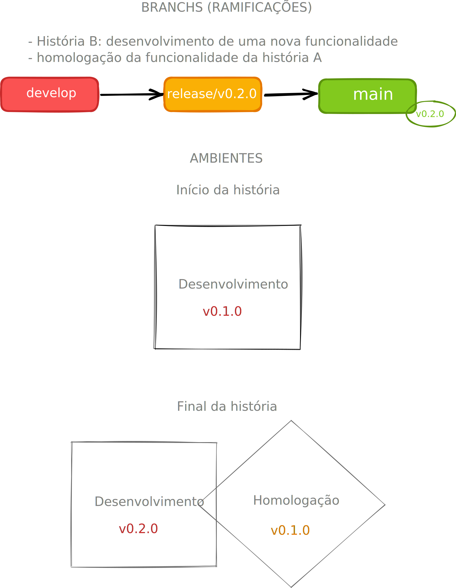
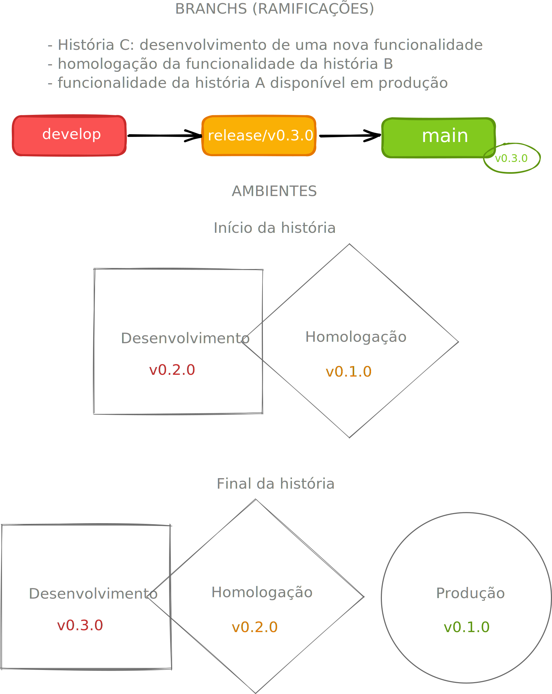
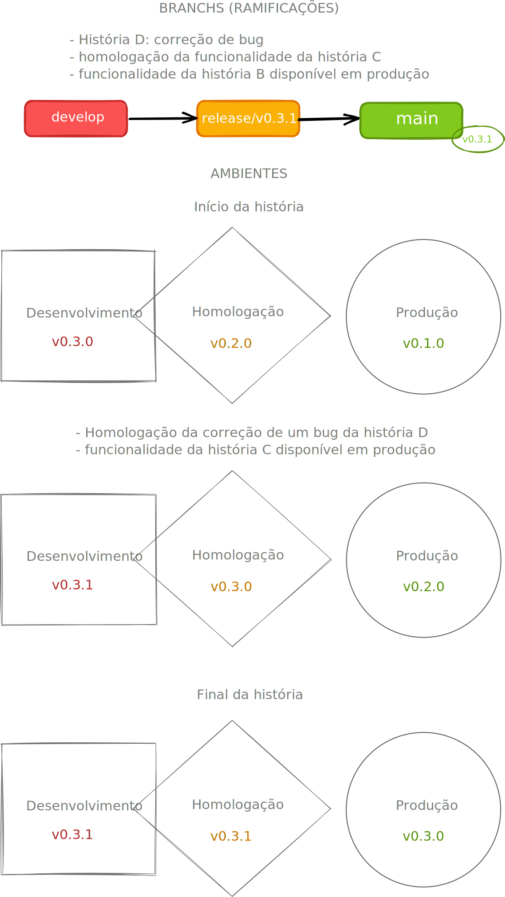
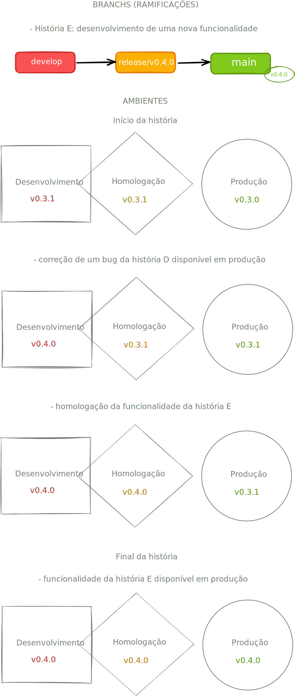

# Roteiro

Referência: [Semantic Versioning 2.0.0](https://semver.org/)

---

## 1. Os números de versão
Dado um número de versão **MAJOR**.*MINOR*.PATCH, incremente a:

    versão Maior(MAJOR): quando fizer mudanças incompatíveis na API,
    versão Menor(MINOR): quando adicionar funcionalidades mantendo compatibilidade,
    versão de Correção(PATCH): quando corrigir falhas mantendo compatibilidade.

Sob este esquema, os números de versão e a forma como eles mudam transmitem o significado do código subjacente e o que foi modificado de uma versão para a próxima.

## História A: nova funcionalidade

<!--  -->

## História B: nova funcionalidade

## História C: nova funcionalidade

## História D: correção de bug

## História E: nova funcionalidade
